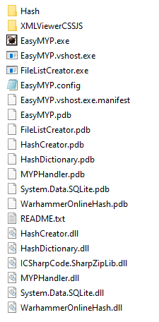
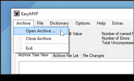
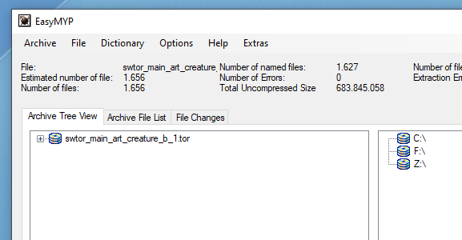
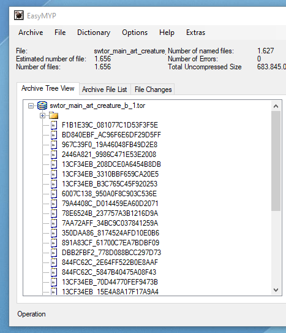
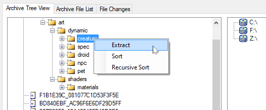
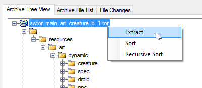
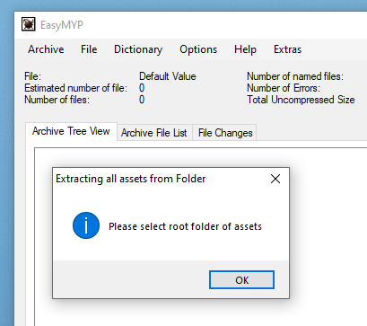
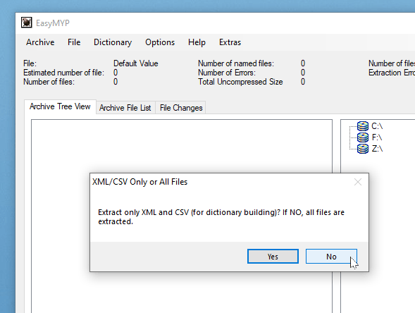

# SWTOR Extractors, Modders, and Dataminers WikiPedia

introduction...

## Table of Contents

| Sections  | Sections |
| :---: | :---: |
| [Overview](https://github.com/SWTOR-Extractors-Modders-Dataminers/WikiPedia#overview)  | [Datamining](https://github.com/SWTOR-Extractors-Modders-Dataminers/WikiPedia#datamining)  |
| [Extracting](https://github.com/SWTOR-Extractors-Modders-Dataminers/WikiPedia#extracting)  | [Resources](https://github.com/SWTOR-Extractors-Modders-Dataminers/WikiPedia#resources)  |
| [Modding](https://github.com/SWTOR-Extractors-Modders-Dataminers/WikiPedia#modding)  | [Getting Help](https://github.com/SWTOR-Extractors-Modders-Dataminers/WikiPedia#getting-help)  |

## Overview

## Extracting

### Extracting SWTOR's Resources With EasyMYP

EasyMYP is a game assets extracting tool. There is an specific SWTOR-compatible version, sometimes alluded to as "TorMYP", which allows us to inspect SWTOR's .tor asset files, extract specific items or groups of items from them, and even extract the assets of a whole folder of .tor files in one go.

EasyMYP can be downloaded from [this repository](https://github.com/SWTOR-Extractors-Modders-Dataminers/EasyMYP).

To be of use, we'll need to download the most current hashes file (a file holding the list of currently identified game objects and their IDs) from [here](https://drive.google.com/drive/folders/1VmoAOY9EM12BV5qeWkiAHaef6nDR0XBT). *hashes\_filename.zip* is the one meant for EasyMYP. Decompress the .zip file to get the *hashes\_filename.txt* file.

(it might be convenient to download *hashes\_filename.bin.gz*, too, as it is used in other tools we'll see about later on when assembling the assets in 3D apps).

#### The EasyMYP tool

EasyMYP, once unzipped, appears as a single folder that can be placed anywhere in our computers (such as, for example, the desktop folder), no installation process needed. Its interesting bits are:

- **EasyMYP.exe**: that's the app as such.

- **Hash**: this folder is were we place the hashes\_filename.txt file, which contains a list of all the game assets that have been identified to date. This file is usually posted by fellow dataminers every time there is a new game update (not just the major ones but minor ones that introduce new Cartel Market armor gear and the like, too). There are hash file releases for the Public Test Server, too.
We can simply drop the file inside the folder and overwrite any older hash file without care.

- **EasyMYP.config**: a human-readable XML file where the app stores its preferences settings. It can be useful to read at times, because it stores the destination folder where the extracted files will be placed, and the app is this bit inconsistent in setting that (there's two ways of doing it, and sometimes I have seen TorMYP show different information for each).

- **README.txt**: the app's instructions. They show up inside the app through the help menu, too.

Every time we launch EasyMYP.exe, we'll see first a brief progress bar showing that it is reading the contents of the hash file. Once done, it'll show its simple interface. Of the many options the app has, we'll use just a few ones, mainly in Archive and Files.

   

#### Extracted items' destination

An important decision to take is where to store the results of its usage, for the following reason: when exporting assets, EasyMYP won't simply ask us where to save them and then leave the files there. What it'll do is recreate the game's internal assets organization inside the folder we choose, which can easily become six or more sublevels deep. For example, the player characters' eye textures will end up located at: *your chosen folder > resources > art > dynamic > player\_character > face\_customization > eye*.

(Don't let that scare us into thinking that finding the extracted material inside that mess will be difficult. On the contrary: Windows and macOS' instant desktop search is our most excellent friend, and most of times we won't have to care for the directory path at all)

So, we start by telling EasyMYP where we want to store all the extracted stuff through File > Select Extraction Folder. If we would happen to forget to do it, the app will ask us the first time we do an extraction, anyway. It can be set through the Options menu, too. Ultimately, it can even be set by opening the EasyMYP.config file in Notepad and typing the folder's directory path.

#### Opening and exploring the game's asset files

In Windows 10 those are typically stored at C:\Program Files (x86)\Electronic Arts\BioWare\Star Wars - The Old Republic\Assets (now that SWTOR is being published through Steam, too, they could be stored somewhere else depending on our Steam preferences).

There, we'll find a lot of files with the .tor extension and fairly informative names.

The most interesting files are the ones containing an "art" in their names:

- Filenames starting with “swtor\_main\_art\_dynamic\_”: those contain body parts, armor parts, and some single piece characters and creatures. These are the ones we will be most interested in if we want to do character-related stuff.

- Filenames starting with “swtor\_main\_art\_area\_”: they contain terrain and buildings’ parts: whole mountains, bridges, buildings and empty rooms; or “construction sets” involving walls, furniture, road parts, etc. Don't confuse them with the ones starting with "swtor\_main\_area\_" without the "\_art\_", as those are maps.

- Other filenames containing the "\_art\_" word: we can find in them weapons, ships, vehicles, "farming" items (crystals, crates, etc.).

The rest of the stuff relates to game audio and translations, animation and FX scripts, user interface art (for example, all the Galactic Trade Network and Cartel Market images, abilities icons, etc.), maps, etc. They are quite interesting, actually, but we can omit them and save a lot of hard disk space.

Let’s say we open "swtor\_main\_art\_creature\_b\_1.tor", which ought to contain a few animals from the game. Get to Archive > Open Archive, navigate to SWTOR’s Assets folder and open that file.

After a few seconds of processing (no progress bars 😕 ), it’ll show up in the left side pane:

We can see the contents of the file by clicking on the Archive File List tab, but it’s more interesting to see them by twirling the little + widget at its left, because it’ll show them in their hierarchical organization structure, which will reflect how they will be saved in the extraction folder that we chose (or will choose the first time we do an export).

Out of that first twirl, we’ll see that there’s a lot of files with unintelligible names, and a folder. The former are assets in that .tor file that we still don’t know what they are (they are not in the hash file yet). Those can be saved and examined: EasyMYP will put them in a subfolder with the same name as the .tor file so that things aren’t too messy.

It’s that lone folder where the really interesting stuff starts:

What we see here are folders where models (.gr2 archives) and textures (.dds archives) are stored. We can begin to get a feel of how things are organized: the “dynamic” folder contains all elements that are animated in the game. The “materials” one contains text files describing what textures correspond to which models, etc.

We should warn you that Bioware isn’t the tidiest developer ever: sometimes things are a bit disorderly, surely out of adding things to the game in ways they hadn’t anticipated before launch.

(By the way, we can open several .tor files during the same session and explore them all this way)

### Exporting specific assets and groups of assets

So, we might want to export a single item:

Or a bunch of items: a whole folder, for example, which is better because sometimes the meshes and textures are in the same folder although grouped into subfolders.

Or one could just extract all the contents of the .tor file and decide what to keep and what to delete afterwards.

### Exporting several whole .tor files' assets in one go

The thing is, all this isn’t the most efficient way to work if we look forward to building whole scenes with landscapes, rooms, props, pets, characters, etc. As all those assets are spread over many .tor files, and the way one looks for them out of swtor.jedipedia.net or torcommunity.com’s data requires to look inside the game’s XML text files that describe their use, it’s best to just batch-export all the .tor files having to do with 3d models. EasyMYP has an option to extract the stuff inside all the .tor files contained in a folder:

A batch extraction of all the 3D models and related files will fill some 40-50 GB. An extraction of just *everything*, including audio files, GTN items’ icons, maps, etc. will fill about 100 GB.

How do we separate the .tor files we want to process from the ones we don’t? By temporarily putting them inside a folder (inside Assets or somewhere else), processing them, and putting them back into Assets afterwards.<u> </u>

So, we click on “Extract All from Folder”. TorMYP will ask we where that folder is, and we point it at it.

Then it asks us a curious question:

What does this mean? EasyMYP is offering us to extract everything (“No” option 🤨) or only the XML text files describing how the assets are organized (“Yes” option): those .xml files tell us, for example, which objects are used to build, say, a chest armor piece, and where they are and what material file is associated with them… which in turn will tell us which texture files it uses and where they are, and what color scheme file is applicable… which in turn will describe what colors the armor will use because oftentimes a same armor object shows up as different items just by changing some colors…

So, we choose "no".

(That said, maybe afterwards we might want to do a second, .xml files-only extraction, from all .tor files, saying “Yes”. These don’t ocuppy much space, help build the whole subfolder organization, and you get the certainty that you have all the .XML information about all the game assets at your fingertips just in case)

Before proceeding, EasyMYP will show a dialog window telling us what’s about to do, giving us a chance to backtrack. Then it’ll start going .tor file by .tor file. They’ll accumulate in the left side pane, which is a way to measure its progress.

A warning, though: sometimes EasyMYP crashes while processing the biggest of those files, so, it's good to keep an eye on its progress. If it happens to crash, we can move the files it already processed out of the temporary folder and back to the Assets one, then relaunch the operation. If we didn’t happen to see in which one the crash occurred, a trick to know it is to look at the contents of the folder storing the results: there ought to be subfolders with the same names as the .tor files it has processed. Just check which was the last one, and restart from there.

This might be a memory issue. We've seen it happen in PCs with 16 GB. of RAM, and the crash usually happens when extracting the first of the big files holding the game's audio ("swtor\_main\_bnk\_audio\_1.tor"), so, it might be prudent to move those to another temporary folder to process them as a second batch job or just dismiss them.

### The results of the extraction and saving some storage space

Once we are done, we can find ourselves with literally thousands of files inside a complex folder structure (a merge of all the subfolders contained in each .tor file) which can be a bit overwhelming. Actually, handling it will be far easier than it looks, because most of times we will be copypasting filenames and the like into Windows' instant search's field, and it will show us not just found filenames but, even more importantly, found .xml files mentioning those filenames without the need to dig deep inside the subfolders tree.

As we mentioned before, the really juicy stuff is in the *resources* folder. The others, named like the .tor files, contain assets whose IDs aren't known yet. They *can* be useful if there is something (an object, a texture file, etc.) that we *know it should be somewhere in there* but can't be found: we can try those folders with a model viewer such as [Noesis](https://github.com/SWTOR-Extractors-Modders-Dataminers/NOESIS) or a free .dds format image viewer such as [XnView](https://www.xnview.com/) or [Noesis]([Noesis](https://github.com/SWTOR-Extractors-Modders-Dataminers/NOESIS)) too. Then again, they could as well be deleted to free hard disk space.

Another measure to free storage space (and to ease browsing through the folders) is to delete the lower polygon count versions of the objects and their associate textures (they are used when they are far away from us in the game). These objects' filenames end in ".lod.gr2", and their textures end in ".tiny.dds". To select them through Windows' desktop search you can copypaste these queries in the search field and delete the results:

".lod.gr2" ext:gr2

".tiny.dds" ext:dds

The "ext:" bit makes sure that you are selecting the mesh and texture files and not any text file that could have been mentioning them. A warning: Windows can take its sweet time to select them all and to make a deletion: we are talking thousands of files. It's better to directly delete them instead of first moving them to the trashcan and then emptying it.

Now that we have the game assets extracted, it's time to learn how to find the ones we need to assemble characters, armor, weapons, vehicles, and environments.

## Modding

## Datamining

## Resources

## Getting Help
